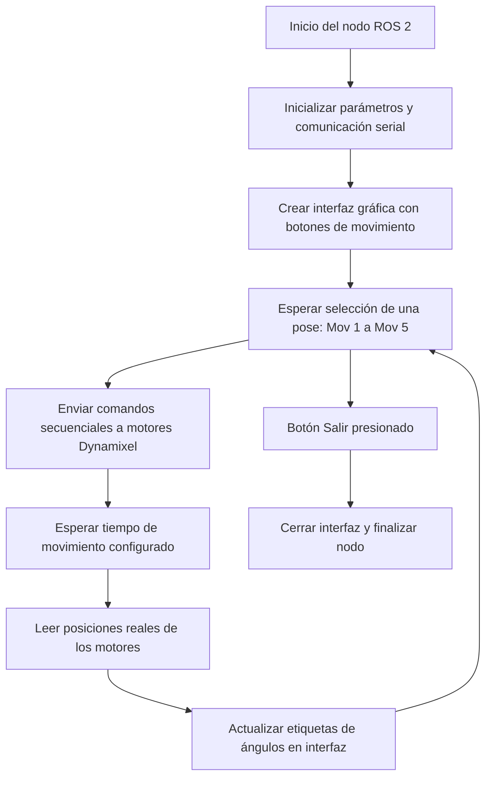

# Laboratorio #4 Cinemática Directa - Phantom X - ROS

## Integrantes:
- Isabella Mendoza Cáceres
- Andrés Santiago Cañón Porras

## Cinemática directa

| Link | θ_i     | d_i   | a_i   | α_i   | θ offset |
|:----:|:-------:|:-----:|:-----:|:-----:|:--------:|
| 0    | θ₁      | 4.00  | 0.00  | 1.57  | 0.00     |
| 1    | θ₂      | 0.00  | 20.50 | 0.00  | 1.57     |
| 2    | θ₃      | 0.00  | 10.50 | 0.00  | 0.00     |
| 3    | θ₄      | 0.00  | 0.00  | -1.57 | -1.57    |
| 4    | θ₅      | 7.50  | 0.00  | 0.00  | 0.00     |

  

## Descripción detallada de la solución planteada
La solución planteada integra los requerimientos del Laboratorio 4 de Cinemática Directa del robot Phantom X Pincher usando ROS 2, servomotores Dynamixel AX-12 y una interfaz gráfica programada en Python. El objetivo principal fue permitir el control de los actuadores del robot mediante comandos enviados desde una interfaz de usuario (HMI), validando los estados articulares reales, y asegurando la correcta ejecución de cinco poses representativas.

  

### Control de articulaciones y comunicación serial
Se implementó un nodo ROS 2 llamado `pincher_controller`, que establece comunicación con los servomotores AX-12 a través del protocolo Dynamixel 1.0, utilizando la biblioteca `dynamixel_sdk`. La conexión se realiza mediante un puerto serial configurado con parámetros ROS como el nombre del puerto (`/dev/ttyUSB0`).

Cada articulación es controlada escribiendo en las direcciones de memoria de los motores:
- `ADDR_GOAL_POSITION` para indicar la posición objetivo.
- `ADDR_MOVING_SPEED` para definir la velocidad de movimiento.
- `ADDR_TORQUE_ENABLE` para activar el torque del motor.

Además, se implementa la lectura de la posición actual de cada articulación desde la dirección `ADDR_PRESENT_POSITION`, lo cual permite visualizar la configuración real del robot luego de cada comando.

### Interfaz gráfica de usuario (HMI)
Se diseñó una interfaz visual con Tkinter, que permite al usuario:
- Seleccionar una de las cinco poses preconfiguradas (Mov 1 a Mov 5) que corresponden a los ángulos articulares indicados en la guía ([`0, 0, 0, 0, 0`], [`25, 25, 20, -20, 0`], [`-35, 35, -30, 30, 0`], [`85,-20, 55, 25, 0`] y [`80, -35, 55, -45, 0`]).
- Visualizar en tiempo real los valores articulares actuales de cada motor, convertidos de bits a grados mediante una función de escala.
- Ejecutar cada pose con una secuencia articulada: primero la base (waist), luego hombro, codo y muñeca, con pausas entre articulaciones.
- Ver un mensaje personalizado de los integrantes del equipo (“Diseñado por Santi & Isa ❤️”).

  

### Lógica del flujo de control
Cada vez que se presiona un botón en la interfaz, se ejecuta el flujo:
- Se envía la posición objetivo (en bits) a cada articulación.
- Se espera un tiempo definido (`delay`) para permitir el movimiento físico.
- Se lee la nueva posición real de los motores y se actualiza la interfaz con los valores en grados.

Este ciclo permite validar que el robot alcanzó la pose deseada y comprobar el cumplimiento de la cinemática directa.

## Diagrama de flujo de acciones del robot unsando la herramieenta Mermaid

## Plano de planta de la ubicación de cada uno de los elementos

## Descripción de las funciones utilizadas
A continuación se presenta en una tabla las funciones utilizadas en el código para desarrollar el laboratorio.

| Función                             | Descripción                                                                 |
|-------------------------------------|-----------------------------------------------------------------------------|
| `__init__(self)`                    | Inicializa el nodo ROS, configura Dynamixel y construye la interfaz gráfica. |
| `create_title(self)`                | Muestra el título superior de la interfaz.                                  |
| `create_button_row(self)`           | Crea los botones horizontales para enviar posiciones predefinidas.          |
| `create_joint_labels(self)`         | Muestra etiquetas para las posiciones actuales de cada articulación.        |
| `create_footer(self)`               | Añade una línea de crédito en la parte inferior.                            |
| `enviar_posicion(self, nombre)`     | Llama a `move_to_position` con una posición del diccionario.                |
| `move_to_position(self, pos)`       | Escribe la posición, velocidad y torque a cada motor; luego actualiza la GUI. |
| `read_current_positions(self)`      | Lee desde los motores las posiciones actuales en bits.                      |
| `update_joint_positions_display(self, pos)` | Muestra los valores convertidos en grados en la GUI.               |
| `convert_bits_to_degrees(self, bits)`| Convierte valores de 0–1023 a grados (siendo 0° 512 bits).              |
| `run(self)`                         | Ejecuta el bucle principal de la ventana tkinter.                           |
| `main()`                            | Inicializa y ejecuta el nodo ROS junto con la interfaz.                     |

## Código del script utilizado para el desarrollo de la práctica
El código utilizado por el pincher se encuentra actualmente subido como anexo del GitHub, el cual se puede ver si se presiona [aquí](./control_servo.py).

## Video del desarrollo del laboratorio

